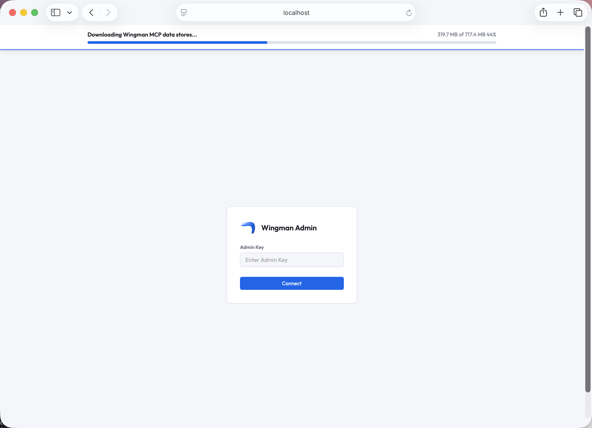
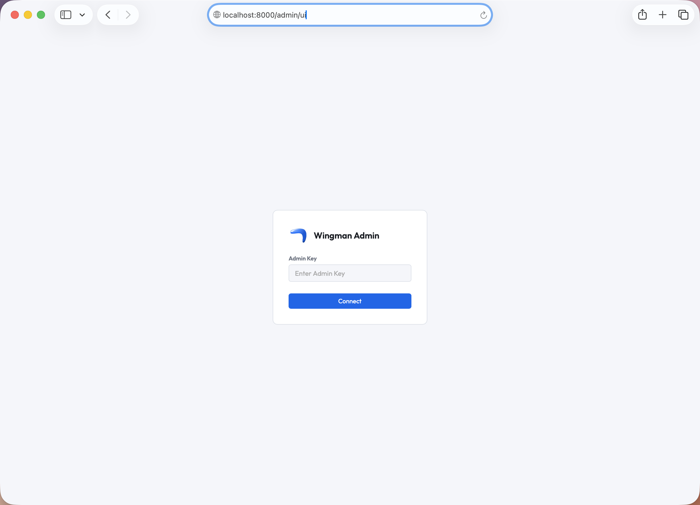
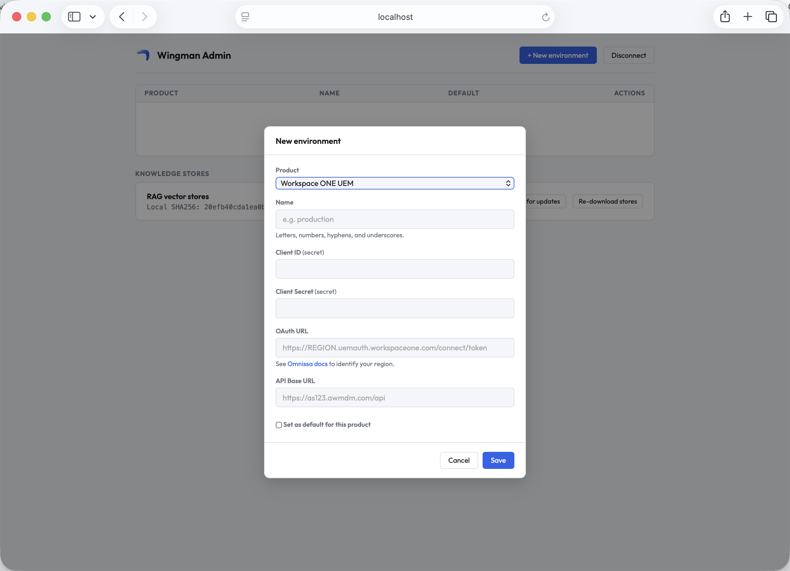
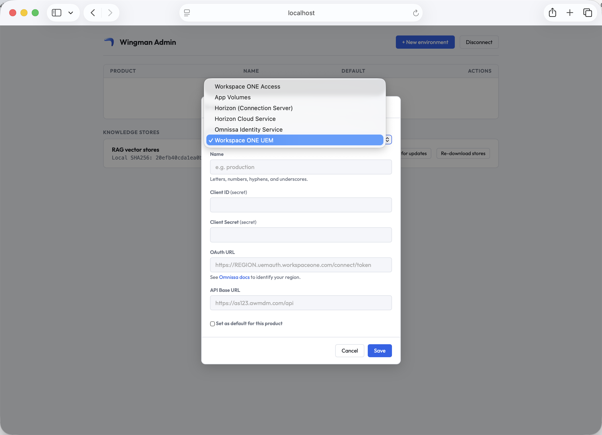

# Wingman

> Your AI sidekick for Omnissa EUC.

Wingman gives AI assistants deep knowledge of Omnissa EUC products: documentation, REST API reference, release notes, and live access to your environments. Ask questions in natural language and get answers grounded in real docs and real data from your tenant.

## Two ways to run it

| | **wingman-mcp** | **Wingman container** |
|---|---|---|
| Best for | An individual on their own machine | A team or org running a shared server |
| Install | `pip install "wingman-mcp[rag]"` | `docker run ghcr.io/tbwfdu/wingman-mcp-server` |
| Transport | Local (stdio) | HTTP (Streamable-HTTP) |
| Credentials | Your own, via `wingman-mcp auth set` | Per-user headers, or shared admin environments |
| Access control | n/a (single user) | Full / read-only / admin access keys |

Both expose the same tools: offline documentation search plus live API tools across UEM, Horizon, App Volumes, Access, Identity Service, and Horizon Cloud.

## wingman-mcp

An [MCP server](https://modelcontextprotocol.io) that runs locally and exposes tools to any MCP-compatible AI client (Claude Code, Claude Desktop, Cursor, VS Code Copilot, Windsurf, Codex, and more).

**Documentation search:** instant, offline search across product docs, REST API reference, and release notes using local RAG. No API keys or network access required.

**Live API tools:** search devices, users, profiles, apps, smart groups, and organization groups across UEM, Horizon, App Volumes, Access, Identity Service, and Horizon Cloud. Authenticate once with `wingman-mcp auth set` and your AI assistant can query your tenant directly.

See [wingman-mcp/README.md](wingman-mcp/README.md) for setup instructions and the full tool list.

### Quick start

```bash
pip install "wingman-mcp[rag]"
wingman-mcp status
wingman-mcp auth set   # optional: connect to your environment for live API tools
```

Then add `wingman-mcp serve` to your MCP client of choice. See [wingman-mcp/README.md](wingman-mcp/README.md) for client-specific configuration.

## Wingman container (self-hosted server)

A single container that serves Wingman over HTTP, so a whole team can share one
deployment instead of each person installing the package. No Azure, no Entra, no
API keys; you bring one or more access keys and run the image. On first boot the
documentation, REST API reference, and release-notes RAG stores (~1.6 GB) are
downloaded from a public GitHub Release into `/data/stores`; mount a volume there
and the download happens only once.

- **Multi-user:** hand out full, read-only, and admin access keys, presented in
  the `X-Wingman-Access-Key` header. Read-only callers are blocked from any tool
  that changes an environment or bulk-exports data.
- **Per-user credentials:** each user supplies their own product credentials as
  request headers, scoped to the request and never stored.
- **Shared environments (admin API):** an admin configures product
  environments once (encrypted at rest) and every user shares them.

### First run

Generate all three access keys and write them to an env file:

```bash
{
  echo "WINGMAN_MCP_ACCESS_KEY=$(openssl rand -hex 32)"
  echo "WINGMAN_MCP_READONLY_ACCESS_KEY=$(openssl rand -hex 32)"
  echo "WINGMAN_MCP_ADMIN_KEY=$(openssl rand -hex 32)"
  echo "WINGMAN_MCP_ENCRYPTION_KEY=$(openssl rand -hex 32)"
} > wingman.env
chmod 600 wingman.env
```

> **Keep `wingman.env` safe.** It contains all your access keys and the encryption
> key for the admin store. Restrict its permissions (`chmod 600`), do not commit it
> to version control, and do not delete it: you will need it every time you restart
> or update the container, and the keys cannot be recovered if lost. If you are
> working in a git repository, add `wingman.env` to your `.gitignore`.

Then start the container:

```bash
docker run -d --name wingman -p 8000:8000 \
  --env-file wingman.env -v wingman-stores:/data/stores \
  ghcr.io/tbwfdu/wingman-mcp-server:latest

# Watch the one-time store download on first boot
docker logs -f wingman

# Once it's up:
curl localhost:8000/health   # -> ok
```

The `-v wingman-stores:/data/stores` named volume caches the RAG stores so later starts are instant.

If you manage secrets in an external credentials store, you can pass the keys directly as `-e` flags instead of using an env file:

```bash
docker run -d --name wingman -p 8000:8000 \
  -e WINGMAN_MCP_ACCESS_KEY=<full-key> \
  -e WINGMAN_MCP_READONLY_ACCESS_KEY=<readonly-key> \
  -e WINGMAN_MCP_ADMIN_KEY=<admin-key> \
  -e WINGMAN_MCP_ENCRYPTION_KEY=<encryption-key> \
  -v wingman-stores:/data/stores \
  ghcr.io/tbwfdu/wingman-mcp-server:latest
```

### Environment variables

| Env var | Required | Purpose |
|---|---|---|
| `WINGMAN_MCP_ACCESS_KEY` | Yes\* | Full-access key, presented via the `X-Wingman-Access-Key` header. |
| `WINGMAN_MCP_READONLY_ACCESS_KEY` | No | Read-only key (same header); can call only non-mutating tools. |
| `WINGMAN_MCP_ADMIN_KEY` | No | Enables the `/admin` API for shared environments. |
| `WINGMAN_MCP_ENCRYPTION_KEY` | If admin key set | Encrypts the admin store at rest. The admin API won't start without it. |
| `WINGMAN_MCP_ADMIN_STORE_PATH` | No | Path to the encrypted admin store. Default `~/.wingman-mcp/admin/environments.enc`; point at a mounted volume to persist. |
| `WINGMAN_MCP_ALLOW_ENV_SELECTION` | No | Lets a tool call target any admin environment via its `env` argument. On by default when the admin key is set. Set to `0` or `false` to disable. |
| `WINGMAN_MCP_EXTRA_MUTATING_TOOLS` | No | Comma-separated tool names to additionally treat as mutating (forward-compat for tools added after this image was built). |
| `WINGMAN_MCP_PUBLIC_URL` | No | Canonical URL advertised in discovery docs when behind a proxy / custom domain. |
| `WINGMAN_MCP_DATA_DIR` | No | Where the RAG stores live. Defaults to `/data/stores` in the image; mount a volume here to cache them across restarts. |

\* At least one of `WINGMAN_MCP_ACCESS_KEY` or `WINGMAN_MCP_READONLY_ACCESS_KEY`
must be set, or the server refuses to start.

### Access tiers

Hand out different keys for different levels of access. All are optional and independent; set only the ones you need. A caller presents exactly one key.

| Tier | Env var | Header | Can do |
|---|---|---|---|
| **Full** | `WINGMAN_MCP_ACCESS_KEY` | `X-Wingman-Access-Key` | Any tool, including ones that change the environment. |
| **Read-only** | `WINGMAN_MCP_READONLY_ACCESS_KEY` | `X-Wingman-Access-Key` | Non-mutating tools only. |
| **Admin** | `WINGMAN_MCP_ADMIN_KEY` | `X-Wingman-Admin-Key` | Manage shared environments via the `/admin` API. |

Full and read-only share the `X-Wingman-Access-Key` header; the server tells them apart by value.

### Connect an MCP client

Point any Streamable-HTTP MCP client at the server and send your key in the
`X-Wingman-Access-Key` header:

```json
{
  "mcpServers": {
    "wingman": {
      "type": "http",
      "url": "http://localhost:8000",
      "headers": { "X-Wingman-Access-Key": "<your-access-key>" }
    }
  }
}
```

The documentation-search tools work immediately; the live API tools activate once
credentials are available, either per-user via `X-*` headers or from a shared admin environment.

### Shared environments (admin API)

An admin can configure product credentials once and have every user share them,
so no per-user credential headers are needed. Enable it by adding to your env file:

```
WINGMAN_MCP_ADMIN_KEY=<your-admin-key>
WINGMAN_MCP_ENCRYPTION_KEY=<32-byte-hex-key>
```

Mount a volume at `WINGMAN_MCP_ADMIN_STORE_PATH` so the encrypted store survives restarts.

> ⚠️ Shared environments are a **service-account model**: every holder of a user
> access key acts against the configured tenants. Pair it with the read-only key
> for users who should not make changes, and scope the product credentials accordingly.

#### Admin UI

When the admin key is configured, a browser-based UI is available at `http://<host>:8000/admin/ui`.

**First boot:** The server downloads the knowledge stores (~700 MB) on first start. The UI shows a live progress banner while this completes.



Authenticate with your admin key:



Click **+ New environment**, choose a product, give it a name, fill in the credentials, and save. The first environment created for each product automatically becomes its default.



Supported products: Workspace ONE UEM, App Volumes, Horizon (Connection Server), Horizon Cloud Service, Omnissa Identity Service, and Workspace ONE Access.



From the main table you can edit credentials, switch the default, or delete environments. The **Knowledge stores** card at the bottom shows the local SHA256 of the downloaded stores and lets you check for updates or re-download.

#### Via the REST API

```bash
ADMIN=<your-admin-key>
BASE=http://localhost:8000
```

**Create an environment** (the first one per product becomes the default automatically):

```bash
# Workspace ONE UEM
curl -s -X POST $BASE/admin/environments \
  -H "X-Wingman-Admin-Key: $ADMIN" -H "Content-Type: application/json" \
  -d '{"product":"uem","name":"prod","credentials":{
        "client_id":"your-client-id","client_secret":"your-client-secret",
        "token_url":"https://REGION.uemauth.workspaceone.com/connect/token",
        "api_base_url":"https://as123.awmdm.com"}}' | jq .

# Horizon (Connection Server)
curl -s -X POST $BASE/admin/environments \
  -H "X-Wingman-Admin-Key: $ADMIN" -H "Content-Type: application/json" \
  -d '{"product":"horizon","name":"prod","credentials":{
        "username":"svc-wingman","password":"your-password",
        "server_url":"https://connectionserver.example.com","domain":"CORP"}}' | jq .

# Horizon Cloud Service
curl -s -X POST $BASE/admin/environments \
  -H "X-Wingman-Admin-Key: $ADMIN" -H "Content-Type: application/json" \
  -d '{"product":"horizon_cloud","name":"prod","credentials":{
        "client_id":"your-client-id","client_secret":"your-client-secret",
        "api_base_url":"https://cloud.horizon.omnissa.com","org_id":"your-org-id"}}' | jq .

# App Volumes
curl -s -X POST $BASE/admin/environments \
  -H "X-Wingman-Admin-Key: $ADMIN" -H "Content-Type: application/json" \
  -d '{"product":"app_volumes","name":"prod","credentials":{
        "username":"svc-wingman","password":"your-password",
        "manager_url":"https://appvolumes.example.com"}}' | jq .

# Workspace ONE Access
curl -s -X POST $BASE/admin/environments \
  -H "X-Wingman-Admin-Key: $ADMIN" -H "Content-Type: application/json" \
  -d '{"product":"access","name":"prod","credentials":{
        "client_id":"your-client-id","client_secret":"your-client-secret",
        "tenant_url":"https://TENANT.us0.wss.workspaceone.com",
        "token_url":"https://TENANT.us0.wss.workspaceone.com/SAAS/auth/oauthtoken"}}' | jq .

# Omnissa Identity Service
curl -s -X POST $BASE/admin/environments \
  -H "X-Wingman-Admin-Key: $ADMIN" -H "Content-Type: application/json" \
  -d '{"product":"identity_service","name":"prod","credentials":{
        "client_id":"your-client-id","client_secret":"your-client-secret",
        "tenant_url":"https://your-identity-service-host",
        "token_url":"https://your-identity-service-host/acs/token"}}' | jq .
```

Credential fields per product:

| Product | `product` | Required fields |
|---|---|---|
| Workspace ONE UEM | `uem` | `client_id`, `client_secret`, `token_url`, `api_base_url` |
| Horizon | `horizon` | `username`, `password`, `server_url`, `domain` |
| Horizon Cloud | `horizon_cloud` | `client_id`, `client_secret`, `api_base_url`, `org_id` |
| App Volumes | `app_volumes` | `username`, `password`, `manager_url` |
| Workspace ONE Access | `access` | `client_id`, `client_secret`, `tenant_url`, `token_url` |
| Identity Service | `identity_service` | `client_id`, `client_secret`, `tenant_url`, `token_url` |

**Inspect, update, delete:**

```bash
# List all environments (secrets masked)
curl -s -H "X-Wingman-Admin-Key: $ADMIN" $BASE/admin/environments | jq .

# Rotate credentials
curl -s -X PUT $BASE/admin/environments/uem/prod \
  -H "X-Wingman-Admin-Key: $ADMIN" -H "Content-Type: application/json" \
  -d '{"credentials":{"client_id":"abc123","client_secret":"new-secret",
        "token_url":"https://REGION.uemauth.workspaceone.com/connect/token",
        "api_base_url":"https://as123.awmdm.com"}}' | jq .

# Promote to default
curl -s -X POST $BASE/admin/environments/uem/dev/default \
  -H "X-Wingman-Admin-Key: $ADMIN" | jq .

# Delete (204 No Content; another environment is promoted to default automatically)
curl -s -o /dev/null -w '%{http_code}\n' -X DELETE \
  -H "X-Wingman-Admin-Key: $ADMIN" $BASE/admin/environments/uem/dev
```

**How users consume them:** for any product a user does not send headers for, the server injects the admin store's default environment. Users can target a non-default environment with the `X-Wingman-Environment: <name>` header. Their own credential headers always take precedence.

### Updating

```bash
docker pull ghcr.io/tbwfdu/wingman-mcp-server:latest
docker rm -f wingman && docker run -d --name wingman -p 8000:8000 \
  --env-file wingman.env -v wingman-stores:/data/stores \
  ghcr.io/tbwfdu/wingman-mcp-server:latest
```

## License

See [LICENSE](LICENSE) for details.
