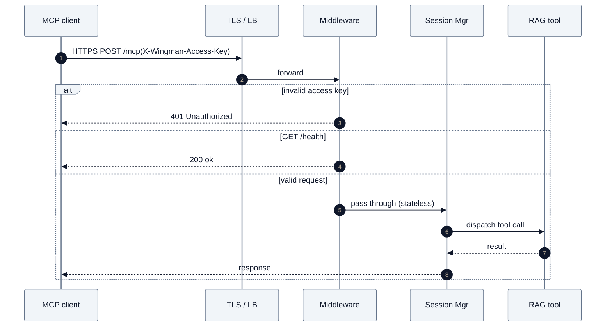

# wingman-mcp architecture diagrams

Two architectural views of the wingman-mcp server: the default local stdio
deployment, and a hypothetical hosted HTTP deployment exposing only the
read-only RAG tools.

## 1. Local stdio mode (full tool surface)

## 2. Hosted HTTP mode (RAG-only)

```mermaid
%%{init: {
  'theme': 'base',
  'themeVariables': {
    'fontFamily': 'ui-sans-serif, system-ui, sans-serif',
    'fontSize': '13px',
    'primaryColor': '#f8fafc',
    'primaryTextColor': '#0f172a',
    'primaryBorderColor': '#94a3b8',
    'lineColor': '#475569',
    'clusterBkg': '#f8fafc',
    'clusterBorder': '#cbd5e1'
  },
  'flowchart': { 'curve': 'basis', 'nodeSpacing': 40, 'rankSpacing': 55 }
}}%%
flowchart LR
  subgraph Clients["Remote MCP clients"]
    direction TB
    U1[Claude Desktop / Code]
    U2[Cursor / VS Code]
    U3[Any MCP client]
    U4[Web app / agent backend]
  end

  Clients ==>|"HTTPS · /mcp"| LB

  subgraph Server["wingman-mcp serve --http"]
    direction TB
    LB(["TLS / load balancer"]):::infra
    Mid[["CredentialHeaderMiddleware"]]:::infra
    SM[["StreamableHTTPSessionManagerstateless"]]:::infra
    Router{{"FastMCP router · RAG only"}}:::infra

    LB --> Mid --> SM --> Router

    RAG["RAG search · 4 toolsuem · omnissa · api · release notes"]:::rag
    Embed["embeddings.py"]:::infra
    Router --> RAG --> Embed
  end

  subgraph Storage["Read-only RAG volume"]
    direction TB
    Stores[("Chroma SQLite12 indexed corpora")]:::store
  end

  Embed --> Stores

  subgraph Cfg["Env config (no secrets)"]
    direction TB
    E1["WINGMAN_MCP_DATA_DIR"]:::cfg
    E2["WINGMAN_MCP_ACCESS_KEY"]:::cfg
    E3["WINGMAN_MCP_STORE_*_DIR"]:::cfg
  end

  classDef rag    fill:#dbeafe,stroke:#3b82f6,color:#1e3a8a
  classDef infra  fill:#f1f5f9,stroke:#64748b,color:#0f172a
  classDef store  fill:#d1fae5,stroke:#10b981,color:#064e3b
  classDef cfg    fill:#fef3c7,stroke:#d97706,color:#78350f
```

## Key differences

| Aspect | Local stdio | Hosted HTTP (RAG-only) |
|---|---|---|
| Transport | stdio (JSON-RPC over pipes) | Streamable HTTP at `/mcp` |
| Tools exposed | All 82 (RAG + 6 live product families) | 4 RAG search tools |
| Auth to server | None (subprocess trust boundary) | Optional `X-Wingman-Access-Key` (hmac compare) |
| Outbound product calls | UEM, Horizon, App Volumes, Access, Identity Service, Horizon Cloud | None |
| Secrets | OS keychain + env-var overrides | None required for RAG-only |
| Per-user state | Local `config.json`, named environments | Stateless; `CredentialHeaderMiddleware` would inject per-request creds if live tools were enabled |
| Mutations | `uem_send_device_command`, `horizon_disconnect_sessions`, `horizon_restart_machines`, `app_volumes_grow_writable_volume`, `*_create_user`, exports/migrations | None |
| Install extra | `pip install wingman_mcp-0.4.0...whl` | `pip install 'wingman-mcp[cloud]'` (uvicorn + starlette) |
