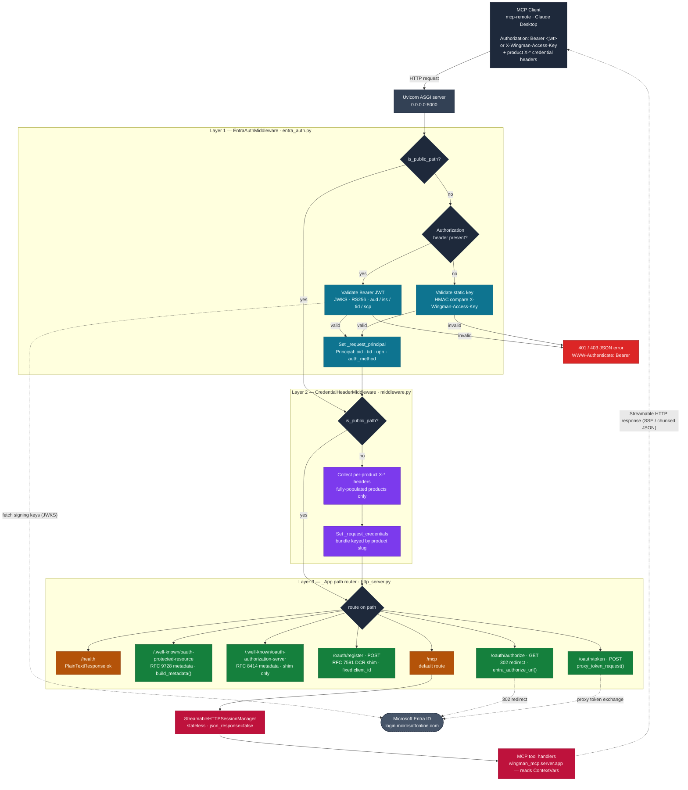

# wingman-mcp HTTP Transport Flow

How an HTTP request travels through the hosted/cloud transport of the
wingman-mcp server, from the MCP client to MCP tool dispatch.

The server wraps the shared MCP tool app (`wingman_mcp.server.app`) in a
three-layer ASGI stack: Entra ID authentication, per-request credential-header
extraction, and a path router that also serves the OAuth discovery and shim
endpoints. Authenticated identity and per-request credentials are carried in
`ContextVar`s; nothing is stored server-side.

> Scope: this diagram covers the HTTP transport, auth, OAuth, and routing
> layers only. The downstream per-product UEM and Horizon environment tool
> flows are deliberately collapsed into a single abstract node.

## Components

| Component | Source | Role |
|-----------|--------|------|
| Uvicorn ASGI server | `http_server.py:250` | Listens on `0.0.0.0:8000`; serves the wrapped ASGI app. |
| EntraAuthMiddleware | `entra_auth.py:52` | Validates `Authorization: Bearer` JWTs against one Entra tenant (JWKS, RS256, `aud`/`iss`/`tid`/`scp`); falls back to `X-Wingman-Access-Key` when no `Authorization` header is sent. Stamps `_request_principal`. |
| CredentialHeaderMiddleware | `middleware.py:54` | Extracts per-product API credentials from `X-*` headers; a product is included only when all of its fields are present. Stamps `_request_credentials`. |
| `_App` path router | `http_server.py:94` | Routes on path: `/health`, OAuth discovery + shim endpoints, and `/mcp` (default). |
| OAuth discovery + shim | `well_known.py`, `oauth_shim.py` | RFC 9728 / 8414 metadata, RFC 7591 registration shim, and `/oauth/authorize` + `/oauth/token` proxying the dance to Entra. |
| StreamableHTTPSessionManager | `http_server.py:61` | Stateless Streamable HTTP transport; dispatches MCP requests to the shared tool app. |

## Notes

- **Public-path bypass.** `/health`, the `/.well-known/*` discovery docs, and the
  `/oauth/*` shim endpoints are listed in `well_known._PUBLIC_PATHS`. Both
  middleware layers check `is_public_path()` and pass straight through to the
  router, so these endpoints are served unauthenticated.
- **Stateless and storage-free.** `_request_principal` and
  `_request_credentials` are `ContextVar`s scoped to a single request. MCP tool
  handlers read them directly; no identity or credential is persisted.
- **Startup guard.** The HTTP server refuses to start unless either
  `ENTRA_TENANT_ID` or `WINGMAN_MCP_ACCESS_KEY` is set (`http_server.py:13`).
- **Shim gating.** The OAuth authorization-server metadata and `/oauth/*` shim
  endpoints return `404` unless both `ENTRA_TENANT_ID` and `ENTRA_CLIENT_ID`
  are configured (`shim_enabled`).
