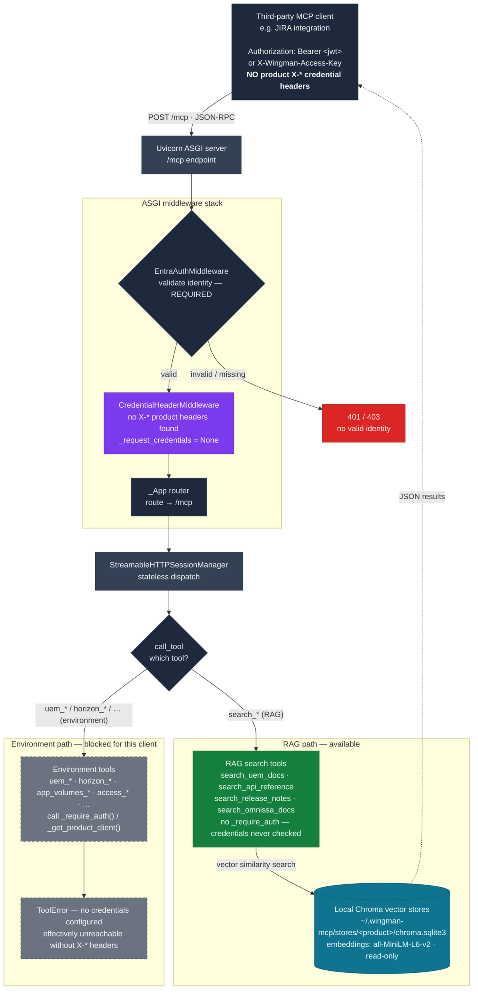
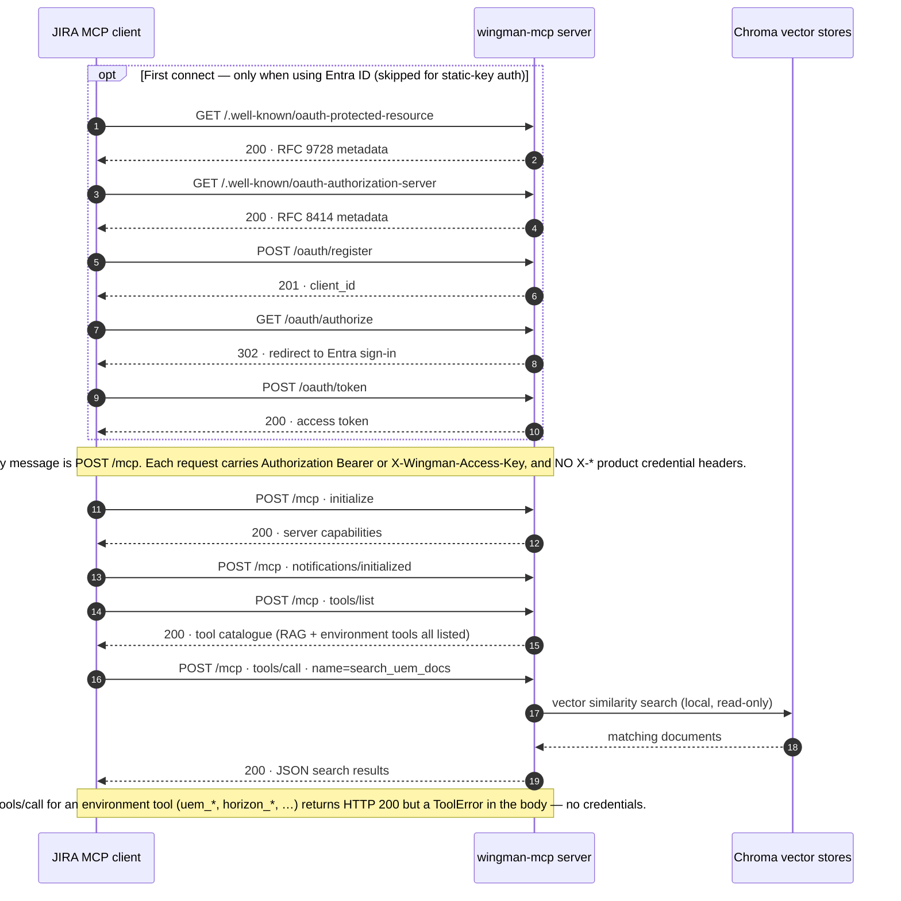

# Third-Party Client — RAG-Only Access Flow

How a third-party MCP client (for example, a JIRA integration) interacts with
the wingman-mcp server to use **only** the RAG documentation search tools, and
not the UEM / Horizon environment tools.

## The short version

The RAG search tools query a **local, read-only documentation index** and need
no product credentials. The environment tools call live UEM / Horizon APIs and
require per-request credentials. A third-party client is confined to RAG by
**what it does not send**: it authenticates to the transport, then simply omits
the product credential headers. Without those headers the environment tools
cannot run, while the RAG tools work normally.

> [!IMPORTANT]
> "RAG-only" is **not enforced by a scope or an allowlist.** The server lists
> every tool to every client (`list_tools()` returns a static list). The
> restriction is *implicit*: environment tools call `_require_auth()` /
> `_get_product_client()` and raise a `ToolError` when no credentials are
> present. If you need a hard, server-enforced guarantee, that does not exist
> today and would require a separate change. See [Limits](#limits-of-this-model).

## API endpoints and request types

All MCP traffic for the RAG-only flow goes to a **single HTTP endpoint, `/mcp`,
by HTTP `POST`** — the transport is MCP Streamable HTTP. The JSON-RPC "method"
inside each POST body is what changes between calls. The OAuth `/.well-known`
and `/oauth/*` endpoints are only touched once, at first connect, and only when
the client uses Entra ID rather than a static access key.

### HTTP endpoints

| Method | Endpoint | Used for | When |
|--------|----------|----------|------|
| `POST` | `/mcp` | All MCP JSON-RPC messages (`initialize`, `tools/list`, `tools/call`) | Every request |
| `GET` | `/mcp` | Optional server→client SSE stream | Rarely — not needed in stateless mode |
| `DELETE` | `/mcp` | Session termination | Returns `405` in stateless mode (no session) |
| `GET` | `/health` | Liveness probe | Optional; unauthenticated |
| `GET` | `/.well-known/oauth-protected-resource` | RFC 9728 resource discovery | First connect, Entra auth only |
| `GET` | `/.well-known/oauth-authorization-server` | RFC 8414 AS discovery | First connect, Entra auth only |
| `POST` | `/oauth/register` | RFC 7591 client registration shim | First connect, Entra auth only |
| `GET` | `/oauth/authorize` | `302` redirect to Entra sign-in | First connect, Entra auth only |
| `POST` | `/oauth/token` | Token exchange proxied to Entra | First connect + token refresh, Entra auth only |

### MCP JSON-RPC request types (inside `POST /mcp`)

| JSON-RPC method | Kind | Purpose |
|-----------------|------|---------|
| `initialize` | request | Protocol + capability handshake |
| `notifications/initialized` | notification | Client signals it is ready |
| `tools/list` | request | Retrieve the tool catalogue |
| `tools/call` | request | Invoke a tool — here, a `search_*` RAG tool |

### Request sequence

## What the third-party client must do

1. **Authenticate to the transport.** There is no unauthenticated MCP access.
   The client presents either an Entra ID `Authorization: Bearer <jwt>` token or
   the static `X-Wingman-Access-Key` header. Failing this returns `401`/`403`.
2. **Send no product credential headers.** The client omits all `X-UEM-*`,
   `X-Horizon-*`, `X-App-Volumes-*`, `X-Access-*`, etc. headers.
   `CredentialHeaderMiddleware` then produces an empty bundle
   (`_request_credentials = None`).
3. **Call only the `search_*` tools.** The four RAG tools below run without any
   credential check.

## The RAG tools and data stores

| Tool | Queries | Store |
|------|---------|-------|
| `search_uem_docs` | Workspace ONE UEM documentation | `~/.wingman-mcp/stores/uem/` |
| `search_api_reference` | REST API endpoint reference (per product) | `~/.wingman-mcp/stores/api/` |
| `search_release_notes` | Combined release notes (per product / version) | `~/.wingman-mcp/stores/release_notes/` |
| `search_omnissa_docs` | General Omnissa product docs (per product) | `~/.wingman-mcp/stores/<product>/` |

- The stores are **local Chroma vector databases** (SQLite-backed). Queries run
  entirely on the server with `sentence-transformers` (`all-MiniLM-L6-v2`)
  embeddings; no outbound API calls are made during a search.
- Content is populated ahead of time by the ingest pipeline, which scrapes the
  Omnissa `docs`, `developer`, and `techzone` sitemaps.
- Dispatch for these four tools lives in `wingman_mcp/server.py:1908`; none of
  them call `_require_auth()`. `search_uem_docs` additionally checks
  `stores_exist()` and reports if the index is missing.

## Limits of this model

- **No tool hiding.** A third-party client still *sees* the environment tools
  in `list_tools()`. It just cannot successfully *run* them without credentials.
- **The guard is the missing credentials, not a policy.** If the same client
  were ever given product credential headers, the environment tools would
  immediately become usable. Treat the credential headers as the actual
  security boundary.
- **Transport auth is shared.** The Entra token / static key that lets the
  client reach `/mcp` is the same one used for full-access clients; it does not
  by itself scope the client to RAG.
- For a server-enforced RAG-only guarantee (a dedicated scope, a per-client
  allowlist, or a RAG-only deployment mode), a code change would be required.
